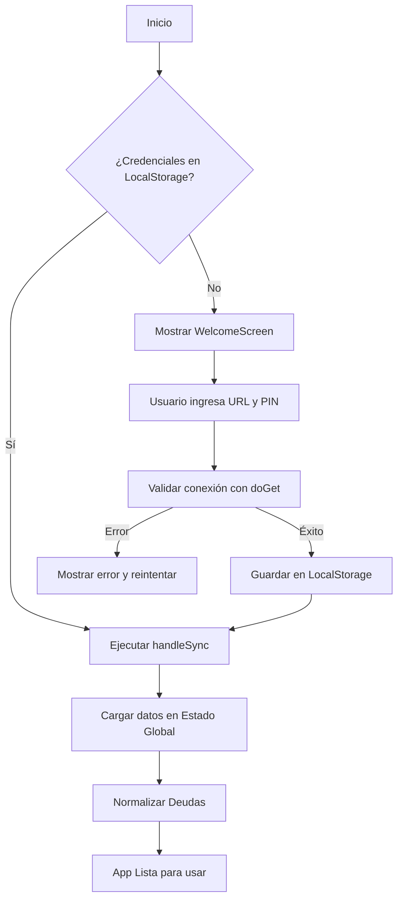
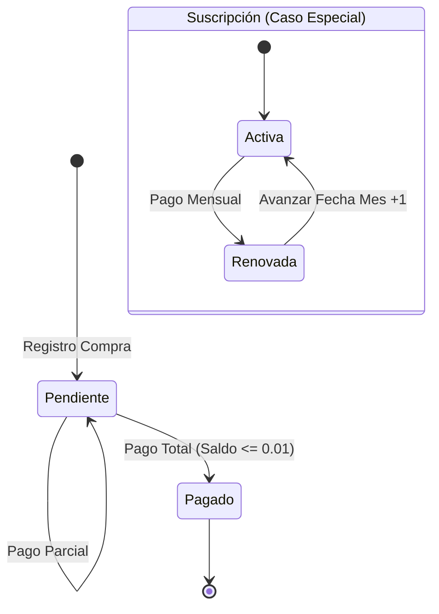
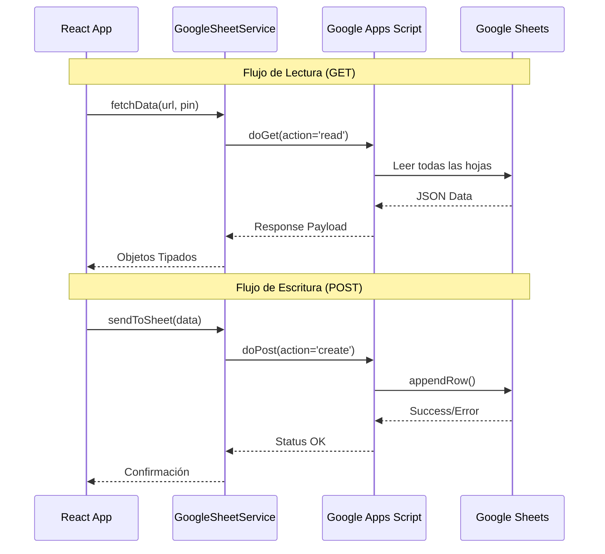

# 📋 Documento de Funcionalidades QA — Finanzas_Gastos

> **Versión:** 1.0  
> **Última actualización:** Febrero 2026  
> **Aplicación:** Finanzas_Gastos — Gestión Financiera Personal  
> **Stack:** React + TypeScript (Frontend) · Google Apps Script (Backend) · Google Sheets (BD)

---

## Tabla de Contenidos

1. [Módulo 1: Bienvenida y Configuración Inicial](#módulo-1-bienvenida-y-configuración-inicial)
2. [Módulo 2: Registro de Movimientos](#módulo-2-registro-de-movimientos)
3. [Módulo 3: Dashboard Principal](#módulo-3-dashboard-principal)
4. [Módulo 4: Gestión de Deudas y Pagos](#módulo-4-gestión-de-deudas-y-pagos)
5. [Módulo 5: Suscripciones](#módulo-5-suscripciones)
6. [Módulo 6: Activos Inmobiliarios](#módulo-6-activos-inmobiliarios)
7. [Módulo 7: Metas de Ahorro](#módulo-7-metas-de-ahorro)
8. [Módulo 8: Reportes y Análisis](#módulo-8-reportes-y-análisis)
9. [Módulo 9: Configuración General](#módulo-9-configuración-general)
10. [Módulo 10: Navegación y Layout](#módulo-10-navegación-y-layout)
11. [Módulo 11: Sincronización y Persistencia](#módulo-11-sincronización-y-persistencia)
12. [Módulo 12: Notificaciones por Email](#módulo-12-notificaciones-por-email)
13. [Reglas de Negocio Críticas](#reglas-de-negocio-críticas)

---

## Módulo 1: Bienvenida y Configuración Inicial

**Componente:** `WelcomeScreen.tsx`  
**Descripción:** Pantalla inicial que guía al usuario en la configuración de conexión con Google Apps Script.

---

### Diagrama de Flujo: Proceso de Conexión



### HU-1.1: Visualización de Pantalla de Bienvenida

> **COMO** usuario nuevo  
> **QUIERO** ver una pantalla de bienvenida con instrucciones claras  
> **PARA** entender cómo configurar la aplicación por primera vez

**Criterios de Aceptación:**

| # | Criterio | Verificación |
|---|----------|:------------:|
| 1 | Se muestra la pantalla de bienvenida cuando no hay `scriptUrl` ni `pin` guardados en `localStorage` | ☐ |
| 2 | Se muestra un campo para ingresar la URL del Google Apps Script | ☐ |
| 3 | Se muestra un campo para ingresar el PIN de seguridad | ☐ |
| 4 | El formulario incluye un botón de "Conectar" para validar la conexión | ☐ |
| 5 | Se muestra una guía paso a paso con instrucciones de configuración | ☐ |

**Snippet relevante — Validación de conexión:**

```typescript
// WelcomeScreen.tsx - Flujo de conexión
const handleConnect = async () => {
  if (!url.trim() || !pinInput.trim()) {
    notify?.("Completa todos los campos", 'error');
    return;
  }
  setLoading(true);
  try {
    const data = await googleSheetService.fetchData(url.trim(), pinInput.trim());
    if (data) {
      onConnect(url.trim(), pinInput.trim());
      notify?.("¡Conexión exitosa!", 'success');
    }
  } catch (error) {
    notify?.("Error de conexión. Verifica URL y PIN", 'error');
  } finally {
    setLoading(false);
  }
};
```

---

### HU-1.2: Validación de Credenciales

> **COMO** usuario  
> **QUIERO** que se valide mi URL y PIN antes de acceder a la app  
> **PARA** asegurar que solo yo pueda acceder a mis datos financieros

**Criterios de Aceptación:**

| # | Criterio | Verificación |
|---|----------|:------------:|
| 1 | No se permite conectar con campos vacíos | ☐ |
| 2 | Se muestra error si la URL es inválida o el PIN es incorrecto | ☐ |
| 3 | Se muestra animación de carga durante la verificación | ☐ |
| 4 | Los datos se persisten en `localStorage` tras conexión exitosa | ☐ |
| 5 | Al recargar la app con credenciales guardadas, se salta la pantalla de bienvenida | ☐ |

---

## Módulo 2: Registro de Movimientos

**Componente:** `UnifiedEntryForm.tsx`  
**Descripción:** Formulario unificado para registrar gastos en efectivo, ingresos y compras con tarjeta de crédito.

---

### Diagrama de Flujo: Registro de Movimiento

```mermaid
graph TD
    A[Iniciar Registro] --> B{Seleccionar Tipo}
    
    B -- Gasto/Ingreso --> C[Formulario Simple]
    C --> D[Validar Monto > 0]
    D --> E[Enviar a Sheet Gastos/Ingresos]
    
    B -- Tarjeta --> F[Seleccionar Tarjeta]
    F --> G{Tipo Operación}
    
    G -- Deuda --> H[Configurar Cuotas]
    H --> I[Calcular Interés TEA]
    I --> J[Generar Plan de Pagos]
    
    G -- Suscripción --> K[Cuota Única (1)]
    K --> L[Fecha Pago = Próximo Cierre]
    
    J --> M[Enviar a Sheet Gastos_Pendientes]
    L --> M
    
    E --> N[Actualizar UI Optimista]
    M --> N
    N --> O[Fin]
```

### HU-2.1: Registro de Gasto en Efectivo

> **COMO** usuario  
> **QUIERO** registrar un gasto en efectivo  
> **PARA** llevar control de mis gastos diarios sin tarjeta

**Criterios de Aceptación:**

| # | Criterio | Verificación |
|---|----------|:------------:|
| 1 | Se muestra un selector de tipo de entrada: "Gasto", "Ingreso", "Tarjeta" | ☐ |
| 2 | Al seleccionar "Gasto", se muestra formulario con: fecha, categoría, descripción, monto, notas | ☐ |
| 3 | El monto debe ser mayor a 0, mostrando error: `'El monto debe ser mayor a cero'` | ☐ |
| 4 | La fecha se pre-carga con la fecha actual | ☐ |
| 5 | Tras enviar, se registra en la hoja "Gastos" de Google Sheets | ☐ |
| 6 | Se muestra toast de confirmación: `'Registrado exitosamente'` | ☐ |
| 7 | Se limpian los campos monto, descripción y notas tras el envío exitoso | ☐ |

---

### HU-2.2: Registro de Ingreso

> **COMO** usuario  
> **QUIERO** registrar un ingreso (salario, freelance, etc.)  
> **PARA** tener visibilidad de mi flujo de ingresos

**Criterios de Aceptación:**

| # | Criterio | Verificación |
|---|----------|:------------:|
| 1 | Al seleccionar "Ingreso", se muestra formulario con: fecha, categoría, descripción, monto, notas | ☐ |
| 2 | Las categorías disponibles son específicas para ingresos (ej: Salario, Freelance) | ☐ |
| 3 | Tras enviar, se registra en la hoja "Ingresos" de Google Sheets | ☐ |
| 4 | El monto se valida como positivo y mayor a 0 | ☐ |

---

### HU-2.3: Registro de Compra con Tarjeta de Crédito (Deuda)

> **COMO** usuario  
> **QUIERO** registrar una compra con tarjeta de crédito  
> **PARA** rastrear mis deudas pendientes y cuotas

**Criterios de Aceptación:**

| # | Criterio | Verificación |
|---|----------|:------------:|
| 1 | Al seleccionar "Tarjeta", se muestra selector de tipo: "Deuda" o "Suscripción" | ☐ |
| 2 | Se debe seleccionar una tarjeta del listado de tarjetas registradas | ☐ |
| 3 | Se calcula automáticamente la `fecha_cierre` y `fecha_pago` según los días configurados de la tarjeta | ☐ |
| 4 | Se puede activar compra en cuotas con selector de número de cuotas | ☐ |
| 5 | Se muestra el costo total con intereses cuando se activan cuotas: `simularCompraEnCuotas()` | ☐ |
| 6 | Se genera un ID único para la deuda: `generateId()` | ☐ |
| 7 | Se agrega al estado local via `onAddPending()` (optimistic update) | ☐ |
| 8 | Se envía a la hoja "Gastos_Pendientes" con campo `tipo_gasto: 'deuda'` | ☐ |

**Snippet relevante — Cálculo de fechas de pago:**

```typescript
// UnifiedEntryForm.tsx - Cálculo automático de fechas
const updatePaymentDates = (cardId: string) => {
  const selectedCard = cards.find(c => `${c.alias}-${c.banco}` === cardId);
  if (!selectedCard) return;

  const today = new Date();
  const diaCierre = Number(selectedCard.dia_cierre);
  const diaPago = Number(selectedCard.dia_pago);

  // Calcular fecha de cierre más cercana
  let fechaCierre = new Date(today.getFullYear(), today.getMonth(), diaCierre);
  if (today.getDate() > diaCierre) {
    fechaCierre.setMonth(fechaCierre.getMonth() + 1);
  }

  // Fecha de pago: siguiente mes al cierre
  let fechaPago = new Date(fechaCierre.getFullYear(), fechaCierre.getMonth(), diaPago);
  if (diaPago <= diaCierre) {
    fechaPago.setMonth(fechaPago.getMonth() + 1);
  }
};
```

---

### HU-2.4: Simulación de Compra en Cuotas con Interés (TEA)

> **COMO** usuario  
> **QUIERO** ver cuánto pagaré en total si compro en cuotas  
> **PARA** tomar decisiones informadas sobre financiamiento

**Criterios de Aceptación:**

| # | Criterio | Verificación |
|---|----------|:------------:|
| 1 | Al activar "Compra en cuotas", se muestra selector con opciones: 3, 6, 12, 18, 24, 36 cuotas | ☐ |
| 2 | Se utiliza la TEA (Tasa Efectiva Anual) de la tarjeta seleccionada para calcular intereses | ☐ |
| 3 | Se muestra el desglose: monto original, monto con interés, cuota mensual | ☐ |
| 4 | Se utiliza la función `simularCompraEnCuotas(monto, cuotas, tea)` de `types.ts` | ☐ |
| 5 | Si no tiene TEA configurada, se calcula sin intereses | ☐ |

**Snippet relevante — Simulación de cuotas:**

```typescript
// types.ts - Función de simulación
export function simularCompraEnCuotas(
  monto: number,
  numCuotas: number,
  teaAnual: number
): { montoTotal: number; montoCuota: number; interesTotal: number } {
  if (numCuotas <= 1 || teaAnual <= 0) {
    return { montoTotal: monto, montoCuota: monto, interesTotal: 0 };
  }
  const tasaMensual = Math.pow(1 + teaAnual / 100, 1 / 12) - 1;
  const montoCuota = monto * (tasaMensual * Math.pow(1 + tasaMensual, numCuotas))
    / (Math.pow(1 + tasaMensual, numCuotas) - 1);
  const montoTotal = montoCuota * numCuotas;
  return { montoTotal, montoCuota, interesTotal: montoTotal - monto };
}
```

---

### HU-2.5: Registro de Suscripción

> **COMO** usuario  
> **QUIERO** registrar una suscripción recurrente (Netflix, Spotify, etc.)  
> **PARA** rastrear mis gastos mensuales automáticos

**Criterios de Aceptación:**

| # | Criterio | Verificación |
|---|----------|:------------:|
| 1 | Al seleccionar tipo "Suscripción", se predefine `num_cuotas: 1` | ☐ |
| 2 | No se muestra opción de cuotas para suscripciones | ☐ |
| 3 | Se envía con `tipo_gasto: 'suscripcion'` a Google Sheets | ☐ |
| 4 | La fecha de pago refleja el próximo vencimiento de la tarjeta | ☐ |

---

## Módulo 3: Dashboard Principal

**Componente:** `Dashboard.tsx`  
**Descripción:** Vista principal con resumen financiero mensual, gráficos y transacciones recientes.

---

### HU-3.1: Resumen de Flujo de Efectivo Mensual

> **COMO** usuario  
> **QUIERO** ver mi flujo de efectivo del mes actual  
> **PARA** entender rápidamente mi situación financiera

**Criterios de Aceptación:**

| # | Criterio | Verificación |
|---|----------|:------------:|
| 1 | Se muestra tarjeta "Flujo de Efectivo (Mes)" con ingresos y gastos del mes actual | ☐ |
| 2 | Los ingresos se muestran en verde con ícono ↑ | ☐ |
| 3 | Los gastos se muestran en rojo con ícono ↓ | ☐ |
| 4 | Se incluye gráfico de barras horizontal comparando ingresos vs gastos | ☐ |
| 5 | El título incluye el nombre del mes actual en español (ej: "junio") | ☐ |
| 6 | Los montos se formatean como moneda: `formatCurrency()` | ☐ |

---

### HU-3.2: Salud Crediticia

> **COMO** usuario  
> **QUIERO** ver el estado de mi deuda total y uso de línea de crédito  
> **PARA** mantener un uso responsable de mis tarjetas

**Criterios de Aceptación:**

| # | Criterio | Verificación |
|---|----------|:------------:|
| 1 | Se muestra "Deuda Total Tarjetas" calculada como `Σ(monto - monto_pagado_total)` | ☐ |
| 2 | Se muestra barra de progreso de "Uso de Línea" como porcentaje: `(deudaTotal / limiteTotal) * 100` | ☐ |
| 3 | La barra cambia a **rojo** si el uso supera 70% | ☐ |
| 4 | Se muestra monto "Disponible para compras": `limiteTotal - deudaTotal` | ☐ |
| 5 | El porcentaje de uso se muestra con un decimal | ☐ |

**Snippet relevante — Cálculo de salud crediticia:**

```typescript
// Dashboard.tsx - Cálculo de deuda y disponible
cards.forEach(c => limiteTotal += Number(c.limite));
pendingExpenses.forEach(p => {
    const total = Number(p.monto) || 0;
    const montoPagadoTotal = Number(p.monto_pagado_total) || 0;
    const deudaRestante = total - montoPagadoTotal;
    deudaTotal += deudaRestante;
});
const disponible = Math.max(0, limiteTotal - deudaTotal);
const usoCredito = limiteTotal > 0 ? (deudaTotal / limiteTotal) * 100 : 0;
```

---

### HU-3.3: Comparación Semanal de Gastos

> **COMO** usuario  
> **QUIERO** comparar mis gastos de esta semana con la semana pasada  
> **PARA** identificar tendencias de gasto a corto plazo

**Criterios de Aceptación:**

| # | Criterio | Verificación |
|---|----------|:------------:|
| 1 | Se muestra tarjeta "Comparación Semanal" con gastos de esta semana y la pasada | ☐ |
| 2 | Se muestra variación porcentual entre semanas | ☐ |
| 3 | Si gasté **más** esta semana → indicador rojo con ícono ↑ | ☐ |
| 4 | Si gasté **menos** esta semana → indicador verde con ícono ↓ | ☐ |
| 5 | Se muestra la diferencia absoluta en moneda | ☐ |

---

### HU-3.4: Pagos de Tarjeta Este Mes y Próximo Mes

> **COMO** usuario  
> **QUIERO** ver cuánto debo pagar en tarjetas este mes y el próximo  
> **PARA** planificar mi liquidez y evitar mora

**Criterios de Aceptación:**

| # | Criterio | Verificación |
|---|----------|:------------:|
| 1 | Se muestran dos tarjetas: "Pago Este Mes" y "Pago Próximo Mes" | ☐ |
| 2 | Se agrupa el total por tarjeta dentro de cada mes | ☐ |
| 3 | Se muestran los días de pago de cada tarjeta | ☐ |
| 4 | Para suscripciones, se usa el monto completo | ☐ |
| 5 | Para deudas, se calcula una cuota mensual: `monto / num_cuotas` | ☐ |
| 6 | Solo se incluyen deudas con cuotas sin pagar: `cuotas_pagadas < num_cuotas` | ☐ |

---

### HU-3.5: Distribución por Tarjetas

> **COMO** usuario  
> **QUIERO** ver cómo se distribuye mi deuda entre mis tarjetas  
> **PARA** identificar qué tarjeta concentra más deuda

**Criterios de Aceptación:**

| # | Criterio | Verificación |
|---|----------|:------------:|
| 1 | Se muestra sección "Distribución por Tarjetas" con barras de progreso por tarjeta | ☐ |
| 2 | Se puede filtrar entre "Este Mes" y "Total" | ☐ |
| 3 | Filtro "Este Mes": muestra solo cuotas del mes actual | ☐ |
| 4 | Filtro "Total": muestra toda la deuda restante por tarjeta | ☐ |
| 5 | Cada tarjeta muestra monto y porcentaje del total | ☐ |
| 6 | Se ordena por monto descendente | ☐ |

---

### HU-3.6: Balance Total Histórico

> **COMO** usuario  
> **QUIERO** ver mi balance total acumulado (ingresos - gastos)  
> **PARA** saber cuánto he ahorrado o perdido en el tiempo

**Criterios de Aceptación:**

| # | Criterio | Verificación |
|---|----------|:------------:|
| 1 | Se muestra tarjeta destacada con borde doble mostrando el balance total | ☐ |
| 2 | Balance positivo → color verde | ☐ |
| 3 | Balance negativo → color rojo | ☐ |
| 4 | Incluye total de ingresos y gastos históricos debajo | ☐ |

---

### HU-3.7: Transacciones Recientes

> **COMO** usuario  
> **QUIERO** ver mis últimas transacciones agrupadas por día  
> **PARA** revisar rápidamente mi actividad financiera reciente

**Criterios de Aceptación:**

| # | Criterio | Verificación |
|---|----------|:------------:|
| 1 | Se muestran las últimas 10 transacciones (efectivo + tarjeta combinadas) | ☐ |
| 2 | Se agrupan por día: "Hoy", "Ayer", o "X de [mes]" | ☐ |
| 3 | Se muestra la hora de cada transacción | ☐ |
| 4 | Gastos en tarjeta se identifican con ícono de tarjeta de crédito | ☐ |
| 5 | Ingresos se muestran en verde, gastos en rojo | ☐ |
| 6 | Se muestra categoría y descripción de cada transacción | ☐ |
| 7 | Se soportan botones de editar y eliminar si se pasan los callbacks correspondientes | ☐ |

---

### HU-3.8: Activos Inmobiliarios en Dashboard

> **COMO** usuario  
> **QUIERO** ver un resumen de mis activos inmobiliarios en el dashboard  
> **PARA** tener visibilidad de mi patrimonio total

**Criterios de Aceptación:**

| # | Criterio | Verificación |
|---|----------|:------------:|
| 1 | La sección solo aparece si hay inversiones inmobiliarias registradas | ☐ |
| 2 | Se muestran 4 métricas: Inversión Total, Valor Actual, Plusvalía, Renta Mensual | ☐ |
| 3 | La plusvalía se muestra en verde (positiva) o rojo (negativa) con porcentaje | ☐ |
| 4 | Se lista cada propiedad con detalle: nombre, tipo, valor de compra, valor actual, renta | ☐ |

---

## Módulo 4: Gestión de Deudas y Pagos

**Componentes:** `DebtList.tsx`, `PaymentForm.tsx`, `debtUtils.ts`  
**Descripción:** Visualización de deudas activas y procesamiento de pagos.

---

### Diagrama de Flujo: Ciclo de Vida de Deuda



### HU-4.1: Visualización de Deudas Activas

> **COMO** usuario  
> **QUIERO** ver una lista de todas mis deudas activas con saldo pendiente  
> **PARA** saber cuánto debo y a qué tarjetas

**Criterios de Aceptación:**

| # | Criterio | Verificación |
|---|----------|:------------:|
| 1 | Se muestran solo deudas con `saldo_pendiente > 0.1` (excluye suscripciones) | ☐ |
| 2 | Cada deuda muestra: descripción, tarjeta, cuotas pagadas/total, saldo restante | ☐ |
| 3 | Barra de progreso muestra porcentaje pagado | ☐ |
| 4 | Deudas vencidas se resaltan con borde rojo y texto "VENCIDO" | ☐ |
| 5 | Si no hay deudas, se muestra mensaje: "¡Estás al día!" con ícono ✓ | ☐ |
| 6 | Se muestra total de deuda pendiente en el encabezado | ☐ |

**Snippet relevante — Reglas invariantes de deuda:**

```typescript
// debtUtils.ts - Reglas de negocio críticas
// REGLAS INVARIANTES (NUNCA deben violarse):
// 1. saldo_pendiente = monto - monto_pagado_total
// 2. Una deuda es ACTIVA si saldo_pendiente > 0
// 3. El campo 'estado' del backend es informativo, pero saldo_pendiente manda
// 4. Frontend NUNCA decide si una deuda existe - solo renderiza

export function isDeudaActiva(deuda: PendingExpense): boolean {
  if (deuda.tipo === 'suscripcion') return false;
  const saldoPendiente = calcularSaldoPendiente(deuda);
  return saldoPendiente > 0.01; // Tolerancia para punto flotante
}
```

---

### HU-4.2: Pago de Cuota Individual

> **COMO** usuario  
> **QUIERO** pagar una cuota de una deuda  
> **PARA** reducir mi saldo pendiente

**Criterios de Aceptación:**

| # | Criterio | Verificación |
|---|----------|:------------:|
| 1 | Se puede seleccionar una deuda para pagar desde la vista "Deudas" | ☐ |
| 2 | Se muestra modal de pago con opciones: "Cuota", "Pago Total", "Pago Parcial" | ☐ |
| 3 | Tipo "Cuota": precalcula `monto / num_cuotas` como monto a pagar | ☐ |
| 4 | Se incrementa `cuotas_pagadas` y `monto_pagado_total` | ☐ |
| 5 | Si `cuotas_pagadas >= num_cuotas`, el estado cambia a "Pagado" | ☐ |
| 6 | No se permite pagar más que la deuda pendiente (margen de error 0.1) | ☐ |
| 7 | Se registra el pago en la hoja "Pagos" de Google Sheets | ☐ |
| 8 | Se registra el gasto correspondiente en la hoja "Gastos" | ☐ |

**Snippet relevante — Lógica de pago:**

```typescript
// PaymentForm.tsx - Cálculo de pago
const montoTotal = Number(selectedExpense.monto);
const numCuotas = Number(selectedExpense.num_cuotas);
const montoCuota = montoTotal / numCuotas;

const montoPagadoAnterior = selectedExpense.monto_pagado_total || 0;
const nuevoMontoPagadoTotal = montoPagadoAnterior + montoPagado;
const nuevasCuotasPagadas = nuevoMontoPagadoTotal / montoCuota;

let newEstado: 'Pendiente' | 'Pagado' = 'Pendiente';
if (cuotasPagadasFinal >= numCuotas) {
  newEstado = 'Pagado';
}
```

---

### HU-4.3: Verificación de Persistencia de Pago

> **COMO** usuario  
> **QUIERO** que el sistema verifique que mi pago se guardó correctamente  
> **PARA** evitar inconsistencias entre la app y Google Sheets

**Criterios de Aceptación:**

| # | Criterio | Verificación |
|---|----------|:------------:|
| 1 | Después de enviar el pago, se espera 3 segundos | ☐ |
| 2 | Se realiza un `fetchData()` para obtener datos frescos del backend | ☐ |
| 3 | Se compara `monto_pagado_total` guardado vs esperado | ☐ |
| 4 | Si la diferencia es > 0.5, se muestra warning al usuario | ☐ |
| 5 | Independientemente de la verificación, se actualiza el estado local | ☐ |

---

### HU-4.4: Normalización Automática de Deudas

> **COMO** sistema  
> **QUIERO** normalizar los datos de deudas al cargar del backend  
> **PARA** garantizar consistencia de datos incluso si Google Sheets tiene formatos irregulares

**Criterios de Aceptación:**

| # | Criterio | Verificación |
|---|----------|:------------:|
| 1 | Si `monto_pagado_total` no existe pero `cuotas_pagadas > 0`, se calcula: `cuotas_pagadas × (monto / num_cuotas)` | ☐ |
| 2 | Si `estado = 'Pagado'` pero `saldo > 0.01`, se corrige automáticamente a 'Pendiente' | ☐ |
| 3 | Si `estado = 'Pendiente'` pero `saldo ≤ 0.01`, se corrige a 'Pagado' | ☐ |
| 4 | Se logea un warning en consola para cada corrección automática | ☐ |
| 5 | Montos con formato regional (ej: "2.000,00") se parsean correctamente | ☐ |

---

## Módulo 5: Suscripciones

**Componentes:** `PaymentForm.tsx`, `debtUtils.ts`  
**Descripción:** Gestión de pagos recurrentes como Netflix, Spotify, etc.

---

### HU-5.1: Pago de Suscripción con Renovación Automática

> **COMO** usuario  
> **QUIERO** marcar como pagada una suscripción mensual  
> **PARA** que automáticamente se renueve al próximo mes

**Criterios de Aceptación:**

| # | Criterio | Verificación |
|---|----------|:------------:|
| 1 | Al pagar una suscripción, la `fecha_pago` se actualiza al mismo día del mes siguiente | ☐ |
| 2 | El estado se mantiene como "Pendiente" (nunca "Pagado" permanente) | ☐ |
| 3 | Si el día original no existe en el siguiente mes (ej: 31 en febrero), se ajusta al último día del mes | ☐ |
| 4 | Se registra el pago en hoja "Pagos" con `tipo_pago: 'Suscripcion'` | ☐ |
| 5 | Se registra como gasto en hoja "Gastos" con descripción: `"[nombre] (Suscripción)"` | ☐ |

**Snippet relevante — Renovación de suscripción:**

```typescript
// PaymentForm.tsx - Lógica de renovación
if (esSuscripcion) {
  const fechaActual = new Date(selectedExpense.fecha_pago);
  const diaOriginal = fechaActual.getDate();
  const proximaFecha = new Date(fechaActual);
  proximaFecha.setMonth(proximaFecha.getMonth() + 1);
  // Fix month overflow (e.g., Jan 31 → Feb 28)
  if (proximaFecha.getDate() !== diaOriginal) {
    proximaFecha.setDate(0); // Last day of previous month
  }
  updatedExpense = {
    ...selectedExpense,
    fecha_pago: proximaFecha.toISOString().split('T')[0],
    estado: 'Pendiente' // Siempre pendiente para suscripciones
  };
}
```

---

### HU-5.2: Diferenciación Visual Suscripciones vs Deudas

> **COMO** usuario  
> **QUIERO** distinguir visualmente mis suscripciones de mis deudas  
> **PARA** gestionarlas de forma independiente

**Criterios de Aceptación:**

| # | Criterio | Verificación |
|---|----------|:------------:|
| 1 | Las suscripciones se filtran con `isSuscripcionActiva()`: `tipo === 'suscripcion' && estado === 'Pendiente'` | ☐ |
| 2 | Las deudas se filtran con `isDeudaActiva()`: `tipo !== 'suscripcion' && saldo > 0.01` | ☐ |
| 3 | Las suscripciones no aparecen en la lista de deudas | ☐ |
| 4 | Las suscripciones muestran monto mensual fijo, no como cuotas | ☐ |

---

## Módulo 6: Activos Inmobiliarios

**Componente:** `AssetsView.tsx`  
**Descripción:** Gestión de inversiones inmobiliarias con carrusel de imágenes y cálculo de plusvalía.

---

### HU-6.1: Vista de Cartera Inmobiliaria

> **COMO** usuario  
> **QUIERO** ver todas mis propiedades con su valor actual y plusvalía  
> **PARA** evaluar el rendimiento de mi portafolio inmobiliario

**Criterios de Aceptación:**

| # | Criterio | Verificación |
|---|----------|:------------:|
| 1 | Se muestra lista de propiedades registradas con: nombre, tipo, valor de compra, valor actual | ☐ |
| 2 | Se calcula plusvalía: `valor_actual - valor_compra` | ☐ |
| 3 | Se muestra porcentaje de plusvalía: `(plusvalía / valor_compra) × 100` | ☐ |
| 4 | Propiedades con renta muestran ingresos mensuales | ☐ |
| 5 | Se incluye carrusel de imágenes por propiedad con navegación (< >) | ☐ |

---

### HU-6.2: Registro de Nueva Propiedad

> **COMO** usuario  
> **QUIERO** agregar una nueva propiedad inmobiliaria  
> **PARA** llevar control de mis inversiones

**Criterios de Aceptación:**

| # | Criterio | Verificación |
|---|----------|:------------:|
| 1 | Se muestra formulario con campos: nombre, tipo, valor de compra, valor actual | ☐ |
| 2 | Opción de indicar si genera renta y monto mensual | ☐ |
| 3 | La propiedad se guarda en Google Sheets y se actualiza el estado local | ☐ |

---

### HU-6.3: Exploración de Propiedades Disponibles

> **COMO** usuario  
> **QUIERO** explorar propiedades del mercado  
> **PARA** evaluar posibles inversiones

**Criterios de Aceptación:**

| # | Criterio | Verificación |
|---|----------|:------------:|
| 1 | Se muestra sección de propiedades disponibles del mercado (si existen) | ☐ |
| 2 | Se pueden filtrar por búsqueda de texto | ☐ |
| 3 | Cada propiedad muestra: ubicación, precio, área, dormitorios, baños | ☐ |
| 4 | Se incluye botón para marcar como "comprada" y agregarla al portafolio | ☐ |

---

## Módulo 7: Metas de Ahorro

**Componente:** `GoalsView.tsx`  
**Descripción:** Configuración y seguimiento de metas de ahorro anuales.

---

### HU-7.1: Configuración de Meta Anual

> **COMO** usuario  
> **QUIERO** definir una meta de ahorro anual con un propósito  
> **PARA** tener un objetivo financiero claro

**Criterios de Aceptación:**

| # | Criterio | Verificación |
|---|----------|:------------:|
| 1 | Se muestra formulario con: meta anual (monto), propósito (texto libre), año | ☐ |
| 2 | Se calcula automáticamente el ahorro mensual necesario: `meta_anual / 12` | ☐ |
| 3 | Se puede editar una meta existente con botón "Editar Meta" | ☐ |
| 4 | Se puede cancelar la edición restaurando valores previos | ☐ |
| 5 | Al guardar, se envía al backend con timestamp | ☐ |

---

### HU-7.2: Seguimiento de Progreso

> **COMO** usuario  
> **QUIERO** ver cuánto llevo ahorrado vs mi meta  
> **PARA** saber si voy por buen camino

**Criterios de Aceptación:**

| # | Criterio | Verificación |
|---|----------|:------------:|
| 1 | Se muestran 3 tarjetas resumen: Total ahorrado, Estado (Completado / En progreso), Falta | ☐ |
| 2 | Barra de progreso visual con porcentaje | ☐ |
| 3 | Si `porcentaje >= 100%` → ícono ✓ verde y texto "¡Completado!" | ☐ |
| 4 | Ahorro se calcula como: `Σ(ingresos_mes) - Σ(gastos_mes)` del año seleccionado | ☐ |
| 5 | El progreso se actualiza automáticamente con datos del historial | ☐ |

---

### HU-7.3: Gráfico de Evolución del Ahorro

> **COMO** usuario  
> **QUIERO** ver un gráfico de línea de mi ahorro acumulado  
> **PARA** visualizar la tendencia a lo largo del año

**Criterios de Aceptación:**

| # | Criterio | Verificación |
|---|----------|:------------:|
| 1 | Se muestra gráfico de línea con los 12 meses del año en eje X | ☐ |
| 2 | Eje Y muestra ahorro acumulado en formato: `S/ Xk` | ☐ |
| 3 | Tooltip muestra valor exacto al pasar cursor | ☐ |

---

### HU-7.4: Tabla de Seguimiento Mensual

> **COMO** usuario  
> **QUIERO** ver un desglose mensual con ingresos, gastos, ahorro y % de meta  
> **PARA** analizar mi rendimiento mes a mes

**Criterios de Aceptación:**

| # | Criterio | Verificación |
|---|----------|:------------:|
| 1 | Tabla con columnas: Mes, Ingresos, Gastos, Ahorro Real, Acumulado, % Meta Anual | ☐ |
| 2 | Ingresos en verde, gastos en rojo | ☐ |
| 3 | Ahorro negativo se muestra en rojo | ☐ |
| 4 | Fila de totales al final con suma del año | ☐ |
| 5 | La tabla se actualiza automáticamente según datos del historial | ☐ |

---

## Módulo 8: Reportes y Análisis

**Componente:** `ReportsView.tsx`  
**Descripción:** Análisis financiero avanzado con gráficos, filtros y métricas de salud.

---

### HU-8.1: Filtro por Rango de Fechas

> **COMO** usuario  
> **QUIERO** filtrar mis reportes por período de tiempo  
> **PARA** analizar mis finanzas en diferentes horizontes

**Criterios de Aceptación:**

| # | Criterio | Verificación |
|---|----------|:------------:|
| 1 | Se ofrecen 4 opciones: 7 días, 1 mes, 3 meses, 1 año | ☐ |
| 2 | El filtro seleccionado se resalta visualmente | ☐ |
| 3 | Todos los gráficos y métricas se actualizan al cambiar el filtro | ☐ |
| 4 | El filtro por defecto es "1 mes" | ☐ |

---

### HU-8.2: Indicadores de Salud Financiera

> **COMO** usuario  
> **QUIERO** ver métricas clave de mi salud financiera  
> **PARA** evaluar rápidamente mi situación económica

**Criterios de Aceptación:**

| # | Criterio | Verificación |
|---|----------|:------------:|
| 1 | Se muestran 4 indicadores: Tasa de Ahorro, Ahorro Total, Uso de Crédito, Total Ingresos | ☐ |
| 2 | Tasa de ahorro ≥ 20% → "¡Excelente!" con ícono verde | ☐ |
| 3 | Tasa de ahorro < 20% → "Puedes mejorar" con ícono ámbar | ☐ |
| 4 | Uso de crédito > 70% → ícono rojo | ☐ |
| 5 | Tasa de ahorro = `(ahorro / totalIngresos) × 100` | ☐ |

---

### HU-8.3: Distribución de Gastos por Categoría

> **COMO** usuario  
> **QUIERO** ver en qué categorías gasto más  
> **PARA** identificar áreas donde puedo reducir gastos

**Criterios de Aceptación:**

| # | Criterio | Verificación |
|---|----------|:------------:|
| 1 | Gráfico circular (Pie Chart) con distribución por categoría | ☐ |
| 2 | Cada categoría tiene color asignado y porcentaje | ☐ |
| 3 | Lista lateral con monto y barra de progreso por categoría | ☐ |
| 4 | Las categorías se ordenan por monto descendente | ☐ |
| 5 | Si no hay datos, se muestra mensaje: "No hay datos de gastos en este período" | ☐ |

---

### HU-8.4: Evolución Mensual (Gráfico de Línea)

> **COMO** usuario  
> **QUIERO** ver la evolución de ingresos, gastos y ahorro a lo largo del tiempo  
> **PARA** identificar tendencias en mi comportamiento financiero

**Criterios de Aceptación:**

| # | Criterio | Verificación |
|---|----------|:------------:|
| 1 | Gráfico de línea con 3 series: Ingresos (verde), Gastos (rojo), Ahorro (azul) | ☐ |
| 2 | Eje X muestra meses en formato "MM/AA" | ☐ |
| 3 | Tooltip muestra valores formateados como moneda | ☐ |
| 4 | Incluye leyenda para identificar cada serie | ☐ |

---

### HU-8.5: Comparación Mensual por Categoría

> **COMO** usuario  
> **QUIERO** comparar mis gastos por categoría entre este mes y el anterior  
> **PARA** detectar incrementos o reducciones significativas

**Criterios de Aceptación:**

| # | Criterio | Verificación |
|---|----------|:------------:|
| 1 | Se muestra cada categoría con montos de "Mes anterior" vs "Este mes" | ☐ |
| 2 | Se calcula variación porcentual entre meses | ☐ |
| 3 | Incremento → flecha roja ↑ | ☐ |
| 4 | Reducción → flecha verde ↓ | ☐ |
| 5 | Sin cambio → flecha gris → | ☐ |

---

### HU-8.6: Historial por Tarjeta

> **COMO** usuario  
> **QUIERO** ver las compras pendientes filtradas por tarjeta  
> **PARA** analizar el uso individual de cada tarjeta

**Criterios de Aceptación:**

| # | Criterio | Verificación |
|---|----------|:------------:|
| 1 | Se muestra selector de tarjetas con botón "Todas" activo por defecto | ☐ |
| 2 | Vista "Todas": tarjetas resumidas con deuda, límite, % de uso y cantidad de compras | ☐ |
| 3 | Al seleccionar una tarjeta: lista de compras con detalle (total, cuotas, por pagar) | ☐ |
| 4 | Compras pagadas muestran badge "PAGADO" en verde | ☐ |
| 5 | Uso > 70% → indicador rojo, ≤ 70% → indicador verde | ☐ |

---

## Módulo 9: Configuración General

**Componente:** `SettingsView.tsx`  
**Descripción:** Gestión de tarjetas, temas, meta de ahorro, notificaciones y conexión al backend.

---

### HU-9.1: Gestión de Tarjetas de Crédito (CRUD)

> **COMO** usuario  
> **QUIERO** agregar, editar y eliminar tarjetas de crédito  
> **PARA** mantener actualizada mi información crediticia

**Criterios de Aceptación:**

| # | Criterio | Verificación |
|---|----------|:------------:|
| 1 | Se muestra lista de tarjetas registradas con: alias, banco, tipo, límite, día cierre/pago | ☐ |
| 2 | Cada tarjeta tiene botones de editar (ícono lápiz) y eliminar (ícono basura) | ☐ |
| 3 | Formulario de nueva tarjeta debajo de la lista | ☐ |
| 4 | Al editar, se abre formulario prellenado con datos actuales | ☐ |
| 5 | Al eliminar, se confirma antes de borrar | ☐ |
| 6 | Campos requeridos: alias, banco, tipo de tarjeta, límite, día de cierre, día de pago | ☐ |

---

### HU-9.2: Selector de Tema Visual

> **COMO** usuario  
> **QUIERO** cambiar el tema visual de la aplicación  
> **PARA** personalizar la apariencia según mi preferencia

**Criterios de Aceptación:**

| # | Criterio | Verificación |
|---|----------|:------------:|
| 1 | Se muestran temas disponibles con preview visual (gradiente de color) | ☐ |
| 2 | El tema activo se resalta con borde y fondo destacado | ☐ |
| 3 | Al seleccionar un tema, se aplica inmediatamente a toda la app | ☐ |
| 4 | La preferencia se persiste entre sesiones | ☐ |
| 5 | Temas disponibles: "Verde esmeralda" (light-premium), "Azul corporativo" | ☐ |

---

### HU-9.3: Visualización de Conexión y Perfil

> **COMO** usuario  
> **QUIERO** ver mi perfil, la URL conectada y el PIN  
> **PARA** verificar mi configuración actual

**Criterios de Aceptación:**

| # | Criterio | Verificación |
|---|----------|:------------:|
| 1 | Se muestra avatar del usuario con nombre y estado "Cuenta Activa" | ☐ |
| 2 | Se muestra URL del Google Apps Script (solo lectura) con botón "Probar" | ☐ |
| 3 | Se muestra PIN oculto con puntos: `'•'.repeat(pin.length)` y cantidad de dígitos | ☐ |
| 4 | Se incluye botón "Reiniciar aplicación" que limpia `localStorage` | ☐ |
| 5 | El botón de reinicio muestra confirmación antes de ejecutar | ☐ |

---

### HU-9.4: Configuración de Meta de Ahorro (desde Settings)

> **COMO** usuario  
> **QUIERO** configurar mi meta de ahorro desde la vista de configuración  
> **PARA** tener acceso rápido sin ir a la vista de Metas

**Criterios de Aceptación:**

| # | Criterio | Verificación |
|---|----------|:------------:|
| 1 | Se muestra sección "Meta de Ahorro" con tabs de navegación interna | ☐ |
| 2 | Si hay meta existente: muestra resumen con Meta Anual, Ahorro Mensual, Propósito | ☐ |
| 3 | Se puede editar la meta existente | ☐ |
| 4 | Si no hay meta: muestra formulario de creación directamente | ☐ |

---

## Módulo 10: Navegación y Layout

**Componente:** `Layout.tsx`  
**Descripción:** Estructura de navegación responsiva con sidebar en desktop y bottom bar en móvil.

---

### HU-10.1: Navegación Desktop (Sidebar)

> **COMO** usuario en desktop  
> **QUIERO** tener una barra lateral de navegación  
> **PARA** acceder fácilmente a todas las secciones

**Criterios de Aceptación:**

| # | Criterio | Verificación |
|---|----------|:------------:|
| 1 | Sidebar visible en pantallas ≥ 768px (md breakpoint) | ☐ |
| 2 | Incluye 6 ítems de navegación: Dashboard, Registrar, Deudas, Activos, Reportes, Configuración | ☐ |
| 3 | El ítem activo se resalta con fondo y color diferenciado | ☐ |
| 4 | En la parte superior se muestra el avatar y nombre del usuario | ☐ |
| 5 | Se muestra indicador de sincronización (hora de última sync) | ☐ |
| 6 | Botón de sincronización manual disponible | ☐ |

---

### HU-10.2: Navegación Móvil (Bottom Bar)

> **COMO** usuario en móvil  
> **QUIERO** tener una barra de navegación inferior  
> **PARA** navegar con facilidad usando el pulgar

**Criterios de Aceptación:**

| # | Criterio | Verificación |
|---|----------|:------------:|
| 1 | Bottom bar visible solo en pantallas < 768px | ☐ |
| 2 | Se muestran los mismos ítems de navegación con íconos | ☐ |
| 3 | El ítem activo se resalta visualmente | ☐ |
| 4 | La barra es fija en la parte inferior (`fixed bottom-0`) | ☐ |
| 5 | El contenido principal tiene padding inferior para no quedar oculto por la barra | ☐ |

---

## Módulo 11: Sincronización y Persistencia

**Componentes:** `App.tsx`, `googleSheetService.ts`  
**Descripción:** Comunicación con el backend y gestión del estado offline.

---

### Diagrama de Arquitectura de Sincronización



### HU-11.1: Sincronización con Google Sheets

> **COMO** usuario  
> **QUIERO** que mis datos estén sincronizados con Google Sheets  
> **PARA** tener un respaldo y poder acceder desde cualquier lugar

**Criterios de Aceptación:**

| # | Criterio | Verificación |
|---|----------|:------------:|
| 1 | Al abrir la app, se ejecuta `handleSync()` automáticamente | ☐ |
| 2 | Se cargan: tarjetas, gastos pendientes, historial, meta de ahorro, perfil, config. de notificaciones | ☐ |
| 3 | Los gastos pendientes se normalizan con `normalizarDeuda()` al cargarse | ☐ |
| 4 | Se muestra animación de carga durante la sincronización inicial | ☐ |
| 5 | Se puede forzar sincronización manual desde el sidebar/settings | ☐ |
| 6 | La hora de última sincronización se muestra en formato legible | ☐ |

---

### HU-11.2: Caché Local (Offline)

> **COMO** usuario  
> **QUIERO** que la app funcione parcialmente sin conexión  
> **PARA** poder revisar mis datos incluso sin internet

**Criterios de Aceptación:**

| # | Criterio | Verificación |
|---|----------|:------------:|
| 1 | Los datos se cachean en `localStorage` tras cada sincronización exitosa | ☐ |
| 2 | Al iniciar sin conexión, se cargan datos desde `localStorage` | ☐ |
| 3 | Se cachean: tarjetas, gastos pendientes, perfil | ☐ |
| 4 | Si la sincronización falla, se muestra toast de error | ☐ |

---

### HU-11.3: Estrategia POST-then-GET

> **COMO** sistema  
> **QUIERO** enviar datos via POST y confirmar via GET  
> **PARA** trabajar correctamente con las limitaciones de CORS de Google Apps Script

**Criterios de Aceptación:**

| # | Criterio | Verificación |
|---|----------|:------------:|
| 1 | Las operaciones de escritura usan `doPost()` al backend GAS | ☐ |
| 2 | Las operaciones de lectura usan `doGet()` al backend GAS | ☐ |
| 3 | Tras cada escritura exitosa, se puede verificar con una lectura posterior | ☐ |

---

## Módulo 12: Notificaciones por Email

**Componentes:** `NotificationSettings.tsx`, `SettingsView.tsx`  
**Descripción:** Configuración y envío de notificaciones de vencimiento por correo electrónico.

---

### HU-12.1: Configuración de Notificaciones

> **COMO** usuario  
> **QUIERO** configurar alertas por email para mis vencimientos de tarjeta  
> **PARA** no olvidarme de pagar a tiempo

**Criterios de Aceptación:**

| # | Criterio | Verificación |
|---|----------|:------------:|
| 1 | Se muestra sección "Notificaciones de Vencimiento" en Configuración | ☐ |
| 2 | Se puede configurar email destinatario | ☐ |
| 3 | Se puede enviar email de prueba: `onSendTestEmail()` | ☐ |
| 4 | Se puede enviar notificaciones manualmente: `onSendNotifications()` | ☐ |
| 5 | Se puede configurar trigger diario automático: `onSetupDailyTrigger()` | ☐ |
| 6 | La configuración se guarda en Google Sheets | ☐ |

---

## Reglas de Negocio Críticas

Esta sección documenta las reglas invariantes que **nunca** deben violarse. Son la base para los casos de prueba más críticos.

---

### RN-1: Cálculo de Saldo Pendiente

```
saldo_pendiente = monto - monto_pagado_total
```

- Nunca puede ser negativo (`Math.max(0, ...)`)
- Se usa tolerancia de 0.01 para errores de punto flotante
- Es la **única fuente de verdad** para determinar si una deuda está activa

---

### RN-2: Estado de Deuda vs Saldo

| Saldo Pendiente | Estado Correcto | Acción si Inconsistente |
|:---------------:|:---------------:|:-----------------------:|
| > 0.01 | `Pendiente` | Auto-corregir a Pendiente |
| ≤ 0.01 | `Pagado` | Auto-corregir a Pagado |

---

### RN-3: Diferencia entre Deuda y Suscripción

| Atributo | Deuda | Suscripción |
|----------|-------|-------------|
| `tipo` | `'deuda'` | `'suscripcion'` |
| Cuotas | Variables (3, 6, 12...) | Siempre 1 |
| Al pagar | Se reduce saldo | Se renueva al próximo mes |
| Estado final | `'Pagado'` (cuando saldo = 0) | Siempre `'Pendiente'` |
| Filtro lista deudas | Incluida | Excluida |

---

### RN-4: Límite de Pago

- **No se puede pagar más que la deuda pendiente**
- Margen de error permitido: 0.1
- Validación en `PaymentForm.tsx`:

```typescript
if (montoPagado > deudaPendiente + 0.1) {
  notify?.(`El monto excede la deuda pendiente`, 'error');
  return;
}
```

---

### RN-5: Uso de Crédito

```
uso_credito = (deuda_total / limite_total) × 100
```

- Si `uso > 70%` → indicador visual rojo (alerta)
- Si `uso ≤ 70%` → indicador visual verde (saludable)

---

### RN-6: Tasa de Ahorro

```
tasa_ahorro = (ahorro / total_ingresos) × 100
ahorro = total_ingresos - total_gastos
```

- Si `tasa ≥ 20%` → "¡Excelente!"
- Si `tasa < 20%` → "Puedes mejorar"

---

### RN-7: Renovación de Suscripciones (Overflow de mes)

Al renovar al siguiente mes, si el día original no existe:

```
// Ejemplo: Suscripción del 31 de enero
// Febrero no tiene día 31
// Se ajusta al 28/29 de febrero (último día del mes)
if (proximaFecha.getDate() !== diaOriginal) {
  proximaFecha.setDate(0); // Último día del mes previo
}
```

---

## Checklist de Pruebas Exploratorias Sugeridas

| Área | Escenario | Prioridad |
|------|-----------|:---------:|
| Registro | Crear gasto con monto 0 → debe rechazar | Alta |
| Registro | Crear gasto con tarjeta sin TEA y cuotas | Alta |
| Pago | Pagar más que la deuda pendiente → debe rechazar | Crítica |
| Pago | Pagar última cuota → estado debe cambiar a "Pagado" | Crítica |
| Suscripción | Pagar suscripción del 31 de enero → fecha debe ser 28/29 feb | Alta |
| Dashboard | Verificar que deudas pagadas no suman en "Deuda Total" | Crítica |
| Dashboard | Verificar cálculo correcto de "Disponible para compras" | Alta |
| Sincronización | Crear registro sin conexión → verificar comportamiento | Media |
| Reportes | Cambiar filtro de período → verificar que gráficos se actualizan | Media |
| Configuración | Eliminar tarjeta con deudas asociadas → verificar integridad | Alta |
| Normalización | Cargar deuda con formato "2.000,00" → debe parsearse correctamente | Crítica |
| Navegación | Verificar que bottom bar no oculta contenido en móvil | Media |
| Temas | Cambiar tema → verificar que todos los textos son legibles | Media |
| Metas | Verificar que el porcentaje nunca supera 100% en la barra visual | Baja |

---

> 📌 **Nota:** Este documento se genera a partir del análisis del código fuente de la aplicación. Las historias de usuario y criterios de aceptación reflejan la funcionalidad implementada, no necesariamente los requisitos originales del producto.
